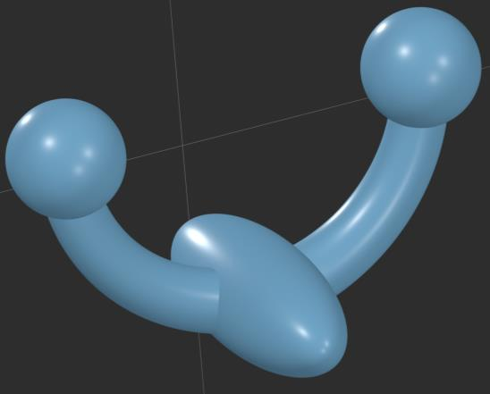
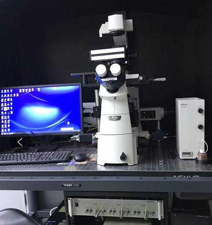
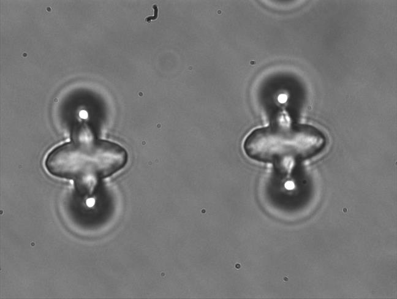
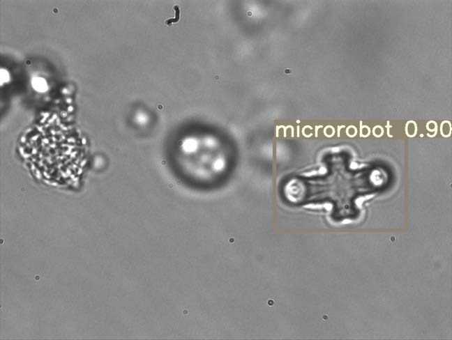
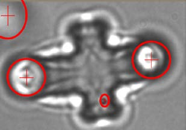

# Machine Learning-Based Real-Time Localization and Automatic Trapping of Multiple Microrobots in Optical Tweezer

[](https://www.python.org/downloads/)
[](https://pytorch.org/)
[](https://opencv.org/)

> **Paper**: Ren, Y., Keshavarz, M., Anastasova, S., Hatami, G., Lo, B., & Zhang, D. (2022). *Machine Learning-Based Real-Time Localization and Automatic Trapping of Multiple Microrobots in Optical Tweezer*. In 2022 International Conference on Manipulation, Automation and Robotics at Small Scales (MARSS) (pp. 1–6). IEEE.

This repository contains the **official implementation** of the methods described in the above paper. This is the original research code developed by the first author during the project at the Hamlyn Centre for Robotic Surgery, Imperial College London.

## Overview

This project provides a complete pipeline for automatic indirect manipulation of biological objects using optical microrobots:

- **ConvNext-based YOLO detector** for real-time microrobot localization with Gaussian modelling
- **Arc-support ellipse detection** with k-means filtering for optimal trapping point determination
- **Multi-target tracking** for simultaneous robot monitoring across frames
- **Visual servoing controller** for automatic laser spot positioning and closed-loop trapping
- **Hardware abstraction layer** supporting both simulation and real optical tweezer (OT) systems
- **Synthetic microscope image generator** for testing without experimental data

<p align="center">
  
  &nbsp;&nbsp;
  
  &nbsp;&nbsp;
  
</p>
<p align="center"><i>Fig. 1 — (Left) CAD model of the microrobot with spherical handles. (Center) Experimental setup with Elliot Scientific E3500 OT system. (Right) Microrobots observed under optical microscope.</i></p>

---

## 📁 Repository Structure

```
.
├── config/
│   └── hardware_config.yaml          # Hardware and control parameters
├── control/
│   ├── hardware_interface.py         # Abstract HW layer + simulation mode
│   ├── visual_servoing.py            # IBVS control + trap allocation
│   └── trapping_controller.py        # High-level trapping orchestrator
├── detection/
│   ├── convnext_yolo.py              # Modified YOLOv4-tiny with ConvNext backbone
│   ├── ellipse_detector.py           # Arc-support ellipse detection (k-means filtering)
│   └── tracker.py                    # Multi-target IoU tracker
├── demo/
│   ├── run_detection_demo.py         # Standalone detection demo
│   └── run_full_pipeline.py          # Full auto-trapping pipeline demo
├── simulation/
│   ├── microscope_simulator.py       # Synthetic microscope image generation
│   └── optical_tweezer_sim.py        # Simplified OT physics (virtual spring model)
├── tests/
│   └── test_ellipse_detection.py     # Unit tests for ellipse detector
├── assets/
│   ├── figures/                      # Paper figures (microrobots & results)
│   └── presentation.mp4              # Pre-presentation video
├── requirements.txt
└── README.md
```

---

## 🚀 Quick Start

### Installation

```bash
git clone https://github.com/clouseren-svg/microrobot-optical-tweezer.git
cd microrobot-optical-tweezer
pip install -r requirements.txt
```

### Run Detection Demo

Detect microrobots and trapping points on a synthetic microscope image:

```bash
python demo/run_detection_demo.py --num_robots 3 --save_viz
```

Output saved to `data/synthetic/detection_demo.jpg`.

### Run Full Trapping Pipeline

Simulate the complete automatic trapping sequence:

```bash
python demo/run_full_pipeline.py --num_robots 3 --visualize
```

Add `--save_video output.mp4` to record the simulation.

### Run Unit Tests

```bash
python tests/test_ellipse_detection.py
```

---

## 🔬 Method Overview

### 1. Microrobot Detection (ConvNext-YOLO)

A modified YOLOv4-tiny architecture with three key improvements:

- **ConvNext-based backbone** replaces CSPDarknet53-tiny. The backbone consists of three ConvNext-based blocks with 5-pixel padding, depthwise separable convolutions (7×7, stride=7), and residual connections containing additional 7×7 depthwise conv + three 1×1 convolutions. This reduces parameters to **30.8M** (7.4M fewer than YOLOv4-tiny) while enhancing feature extraction capability.
- **Gaussian modelling** predicts bounding box coordinates with uncertainty: `μtx, Σtx, μty, Σty, μtw, Σtw, μth, Σth`. A combined Gaussian NLL + CIoU loss is used for training.
- **Self-supervised training** with Mosaic data augmentation eliminates the need for expensive manual annotation. Two training sets were constructed with microrobot out-of-plane poses from 5° to 90° (5° intervals).

Training settings: SGD with momentum 0.9, weight decay 0.0005, initial learning rate 0.001, 6000 iterations.

<p align="center">
  
</p>
<p align="center"><i>Fig. 2 — Real-time microrobot detection result using the proposed ConvNext-YOLO model (confidence: 0.90).</i></p>

**Results (Train Set 1)**:

| Model | Precision | Recall | FPS | FPR |
|-------|-----------|--------|-----|-----|
| **Proposed** | **98.60%** | **99.81%** | **36.02** | **1.48%** |
| Mask-RCNN | 89.46% | 91.41% | 8.13 | 17.34% |
| Faster-RCNN | 99.07% | 96.77% | 14.85 | 12.72% |
| YOLOv3 | 91.39% | 97.35% | 24.37 | 6.75% |
| Gaussian YOLOv3 | 92.15% | 95.42% | 23.46 | 8.41% |
| YOLOv4-tiny | 89.12% | 94.75% | 29.61 | 7.52% |
| YOLOv4 | 93.46% | 98.55% | 18.06 | 9.61% |

### 2. Ellipse Detection for Trapping Points

Four-step pipeline for detecting spherical handles of microrobots:

1. **Arcs Extraction** — Gaussian smoothing → Canny edges → 8-neighbor contour extraction → curvature-based corner splitting using adaptive threshold `Tcorner = α · κ(θmax, σ)`
2. **Arc-Support Groups** — Link line segments satisfying convexity & continuity conditions; the head of one arc-support line segment should be close enough to that of another, and linked segments should align in the same direction
3. **Ellipse Generation** — Fit ellipses to arc groups with region and polarity constraints
4. **K-Means Filtering** — Cluster candidates with `k=13` and remove false positives / outliers

**Result**: 96.77% effective detection rate (EDR) with 1.96% false positive rate, outperforming simple blob detection (74.13% EDR, 8.68% FPR) and Hough Transform (83.61% EDR, 5.34% FPR).

<p align="center">
  
</p>
<p align="center"><i>Fig. 3 — Optimal trapping points (red crosses) detected on the spherical handles of a microrobot.</i></p>

### 3. Automatic Trapping Control

Closed-loop visual servoing pipeline:

1. Detect robots & compute optimal trapping points via ellipse detection
2. Track robots across frames using IoU-based association
3. Allocate laser traps to nearest robots using greedy nearest-neighbor matching
4. Apply PID visual servoing to move traps onto targets (`u = -λ · L⁺ · e`)
5. Verify trapping success (distance < threshold)

---

## 🛠️ Hardware Integration

The `control/hardware_interface.py` provides an abstract base class. To connect to your OT system:

```python
from control.hardware_interface import HardwareInterface

class MyOTHardware(HardwareInterface):
    def connect(self) -> bool:
        # Initialize your SDK / serial connection
        pass

    def move_laser_spot(self, spot_id, x, y):
        # Send position command to galvo / AOD
        pass

    def get_camera_frame(self):
        # Acquire frame from microscope CCD
        pass

    # ... implement remaining methods
```

Pre-defined placeholders included for:
- **Elliot Scientific E3500** (the system used in the paper: 1070 nm laser, Basler CCD camera)
- **Thorlabs** OT systems

The default `hardware_config.yaml` contains parameters matching the experimental setup in the paper.

---

## 🧪 Synthetic Data

No experimental data? No problem. The `simulation/` module generates realistic microscope images:

```python
from simulation.microscope_simulator import MicroscopeSimulator

sim = MicroscopeSimulator(image_size=(640, 480))
image, annotations = sim.generate_multiple(num_robots=3, return_annotations=True)
```

Features:
- Realistic background texture with vignetting and random debris particles
- Microrobot Type A (body: 45×16 px, sphere radius: 14 px) and Type B (body: 35×14 px, sphere radius: 11 px) with spherical handles and out-of-plane pose foreshortening (5°–90°)
- Gaussian noise and PSF blur simulation
- Mosaic data augmentation generator (4-image stitching)
- Laser spot overlay with glow effect

---

## 📊 Performance

Tested on synthetic data (simulation mode):

| Component | Speed | Notes |
|-----------|-------|-------|
| Ellipse Detection | ~15–25 FPS | Depends on image complexity |
| Tracking | >100 FPS | Very lightweight |
| Visual Servoing | >1000 FPS | Pure Python math |
| Full Pipeline | ~25–30 FPS | Bottleneck is detection |

*Note: YOLO inference speed depends on GPU availability. The model architecture is implemented in PyTorch and ready for training with real data.*

---

## 📝 Citation

If you use this code in your research, please cite the original paper:

```bibtex
@inproceedings{ren2022machine,
  title={Machine Learning-Based Real-Time Localization and Automatic Trapping of Multiple Microrobots in Optical Tweezer},
  author={Ren, Yunxiao and Keshavarz, Meysam and Anastasova, Salzitsa and Hatami, Ghazal and Lo, Benny and Zhang, Dandan},
  booktitle={2022 International Conference on Manipulation, Automation and Robotics at Small Scales (MARSS)},
  pages={1--6},
  year={2022},
  organization={IEEE}
}
```

---

## 📄 License

MIT License — See LICENSE file for details.

---

## 🙏 Acknowledgments

- Original experiments conducted at the **Hamlyn Centre for Robotic Surgery, Imperial College London, UK**
- Microrobot fabrication via **Two-photon Polymerization (Nanoscribe GmbH, Germany)** using photoresist IP-L 780
- **Elliot Scientific E3500 Optical Tweezer system** (UK) and **Basler AG CCD camera** (Germany)

---
